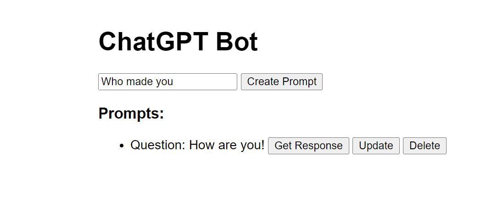

The code provides a simple ChatGPT Bot API implemented using Flask in Python. It allows users to interact with the OpenAI GPT-3.5 engine to generate responses to given prompts. The API supports CRUD (Create, Read, Update, Delete) operations to manage prompts and their responses, which are stored in a text file.
